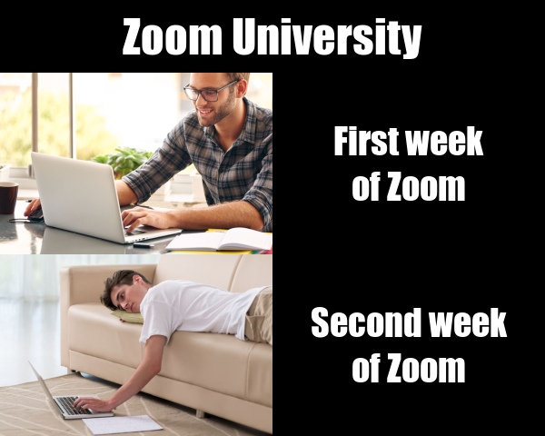

# This is my STATS220 repo! 😝
Hi! I am currently a student at the [University of Auckland](https://www.auckland.ac.nz/) studying computer science and statistics! You can see my work on stats220 on this page!
## My Meme


**Why I created this meme**
1. This meme represents my real reaction to studing on Zoom this semester.
2. There are many students that are motivated at the start of the semester and after a while, they'll become demotivated and lazy, like me😅.
3. I have applied my idea to the general meme format and used the pictures I found on the internet.


### My code
```{r}
library(magick)

# title
title <- image_blank(width = 600, height = 80, color = "#000000") %>%
  image_annotate(text = "Zoom University",
                 color = "#ffffff",
                 size = 50,
                 font = "Impact",
                 gravity = "center")

# top row
first_week <- image_read("https://www.speexx.com/wp-content/uploads/Learning-from-home-featured-image.jpg") %>%
  image_scale(300)

first_week_text <- image_blank(width = 300, height = 200, color = "#000000") %>%
  image_annotate(text = "First week\nof Zoom",
                 color = "#ffffff",
                 size = 40,
                 font = "Impact",
                 gravity = "center")

top_row <- c(first_week, first_week_text) %>%
  image_append()

# bottom row
second_week <- image_read("https://i.pinimg.com/736x/c7/9f/9d/c79f9dc8ec9fa0659d0c1ad286817422--lazy-people-smart-people.jpg") %>%
  image_scale(300)

second_week_text <- image_blank(width = 300, height = 200, color = "#000000") %>%
  image_annotate(text = "Second week\nof Zoom",
                 color = "#ffffff",
                 size = 40,
                 font = "Impact",
                 gravity = "center")

bottom_row <- c(second_week, second_week_text) %>%
  image_append()

# putting it all together
img <- c(title, top_row, bottom_row) %>%
  image_append(stack = TRUE)

image_write(img, "my_meme.png")
```
